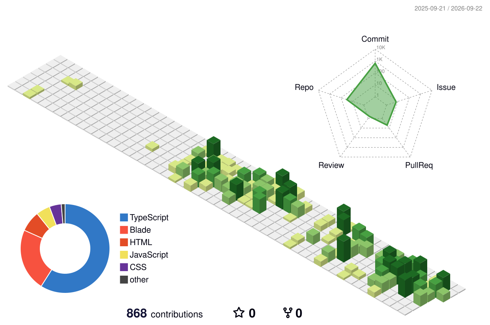
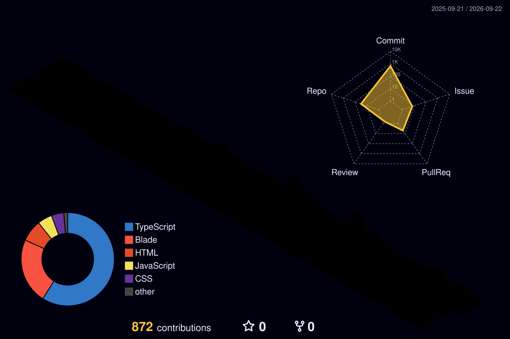

<h1 align="center">Hi 👋, I'm Ch Usama</h1>
<h3 align="center">Laravel & Backend Developer | DevOps Enthusiast | SaaS Builder</h3>

  

---

## 👨‍💻 About Me

- 💻 I specialize in **Laravel**, **REST APIs**, and **microservices**  
- 🌱 Currently learning **NestJS**, **Docker**, **AWS**, and **AI**  
- 🎯 Passionate about building scalable backend systems and dev automation  
- ✨ Side projects help me stay creative and sharpen my problem-solving  
- 🧳 Traveler by heart — helps build patience, discipline, and adaptability

## 📫 Connect with Me

- 🌐 [Portfolio](https://usama-works.vercel.app)
- 📧 devusamaworks@gmail.com
- 📄 [My Resume](https://usama-works.vercel.app/Chaudhary%20Usama%20Munawar.pdf)

---

## 🛠️ Tech Stack

### 🚀 Languages & Frameworks
`PHP` `JavaScript` `Laravel` `NestJS` `Node.js` `React` `Vue` `Typescript`

### ⚙️ DevOps & Tools
`Docker` `GitHub Actions` `Linux` `Bash` `Nginx` `AWS` `Jenkins`

### 💾 Databases & Services
`MySQL` `PostgreSQL` `MongoDB` `Redis` `Firebase` `RabbitMQ` `ElasticSearch`

---

## 📊 GitHub Stats

  

  
  

---

## 🏆 GitHub Achievements

  

## 🏢 Commits Map

